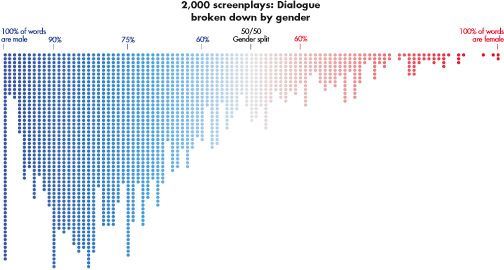

# Male dominated Hollywood
## By Kaiyun Zheng :turtle:
*July 12th, 2023*
## Data Viz Summary.

> We didn’t set out trying to prove anything, but rather compile real data. We framed it as a census rather than a study. So we Googled our way to 8,000 screenplays and matched each character’s lines to an actor. From there, we compiled the number of words spoken by male and female characters across roughly 2,000 films, arguably the largest undertaking of script analysis, ever.

The dot graph titled "2,000 Screenplays: Dialogue Broken Down by Gender" visually represents the distribution of dialogue between men and women in a sample of 2,000 screenplays in [Hollywood](https://en.wikipedia.org/wiki/Hollywood). The graph employs blue dots to depict male characters and red dots to depict female characters. The data in the plot unmistakably indicates that men have a higher frequency of speaking roles within these works, as a considerable number of screenplays exhibit a greater proportion of male characters speaking compared to female characters.

This gender analysis of Hollywood film dialogue graphically provides compelling evidence of men's domination in terms of dialogue distribution. The graph emphasizes the significant disparity between male and female character dialogue, highlighting the prevalent imbalance in gender representation within screenplays. These findings shed light on the ongoing gender inequities in the film industry and call for a more inclusive and balanced approach to storytelling.

## Data Viz Biography.

**1. Who or what institution produced the visualization?**

This visualization is produced by Hanah Anderson and Matt Daniels.

**2. When was it produced?**

It was produced in April 2016.

**3. Who is the audience for the visualization?**

The audience for the visualization is the ones who are interested in data, undistribution power in different gender and cared about feminism.

**4. How might the visualization be interpreted or misinterpreted? What consequences might this interpretation/misinterpretation have?**

The visualization might be interpreted or misinterpreted by contents like, women are not good for movie industry so they have shorter and fewer words inside the screenplay. This leads to a deepening of misunderstanding and discrimination, which makes it worse that women are not valued in the film industry.

**5. How, if at all, does the data visualization represent power or systems?**

The data visualization does show the societal system is dominating by men and the power is centered among their hands, even inside the screenplays.
